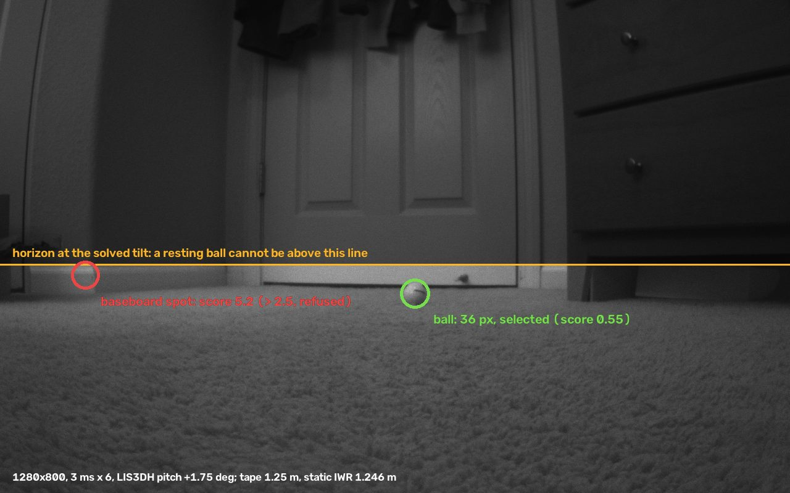
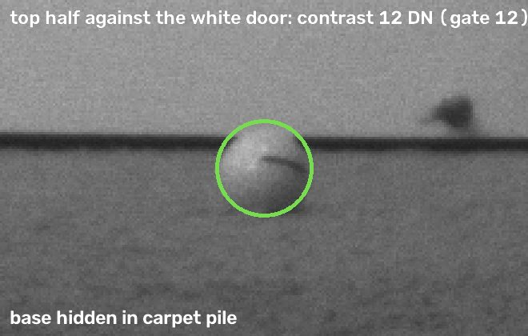
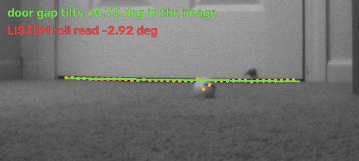
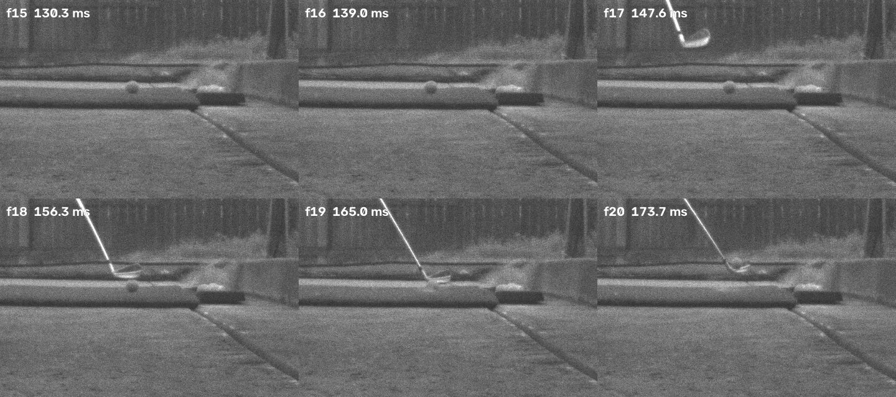

# Behind-the-ball camera and 60 GHz radar fusion

Research log, 29 September 2026. Work on the `feat/tester-capture-pilot` branch of the OpenFlight fork, for maintainers and engineers.

OpenFlight's behind-the-ball subsystem pairs an OV9281 global-shutter camera with a TI IWR6843 radar in one enclosure. This log records what was built, what was measured on real hardware, what the research says the next steps are, and what is still unknown.

Evidence tags follow the project research guide:

- **Measured**: measured on the Pi or on saved frames.
- **Shipped**: in code, with tests.
- **Inferred**: derived, not yet measured.
- **Open**: unknown until tested.

| Result | Value |
|---|---|
| Time to find the resting ball in a full 1280×800 frame | **3.3 s** (was 21 s, and it picked a door knob) |
| Static radar range to the ball vs tape | **1.246 m vs 1.25 m** (first tape match) |
| Lens height solved from the ball and radar | **83 mm** (rig file 95 mm; feet in carpet) |
| Exposure settings to lock the resting ball | **3–7** (was 11–15) |

## Contents

1. [The rig and its conventions](#1-the-rig-and-its-conventions)
2. [Finding the resting ball](#2-finding-the-resting-ball)
3. [Exposure that is calculated](#3-exposure-that-is-calculated)
4. [Heights from the ball, not the floor](#4-heights-from-the-ball-not-the-floor)
5. [Audit: what was wrong](#5-audit-what-was-wrong)
6. [Where the radar sees the ball](#6-where-the-radar-sees-the-ball)
7. [Impact location](#7-impact-location)
8. [Spin and spin axis](#8-spin-and-spin-axis)
9. [Status and next experiments](#9-status-and-next-experiments)
10. [Data and provenance](#10-data-and-provenance)

## 1. The rig and its conventions

The enclosure is the only fixed input. Anything that depends on how the unit was set down (lens height, tilt, where the ball is) is measured each session. Positions below are relative to the lens, seen from behind the unit looking at the target.

| Part | Position relative to the lens | Orientation | Role |
|---|---|---|---|
| OV9281 camera, 2.8 mm lens | origin | level | Resting ball, club head, ball in flight. Modes: 1280×800 @ 120 fps (f ≈ 933 px) or 640×400 @ 288 fps (f ≈ 467 px, 2× binned). |
| IWR6843LEVM, 4-RX centre | in line sideways, 44 mm below, 30 mm behind | 10° up | 60–64 GHz FMCW. Static range to the resting ball; ball-flight track. |
| OPS243 | 85 mm left, 47 mm below, 20 mm behind | 10° up | 24 GHz CW Doppler: ball and club speed. |
| Microphone | 80 mm left, level | n/a | Impact sound, for timing. |
| LIS3DH accelerometer | flat on the shell floor | turned 180° (its +Y points to the back) | Enclosure pitch, applied to the camera rays. |

Conventions used everywhere:

- **Lateral** is positive toward target-right, forward is down the target line, up is against gravity. *Shipped:* one helper had used target-left; it now agrees with the camera rays.
- **Pitch** is positive nose-up. *Measured:* only that sign gives a physically possible lens height on the field frame; the other sign gives 120–160 mm.
- **Heights** are measured from the ball's support, so the ball's centre is one radius (21.3 mm) up by definition. See [section 4](#4-heights-from-the-ball-not-the-floor).
- **Handedness:** right-handed by default; left-handed is an explicit flip.

## 2. Finding the resting ball

Before swings, the tester runs an automatic range setup. The radar records the empty hitting area and then the ball at address. Meanwhile the camera finds the same ball and locks an exposure for it.



*Field frame, 28 September, 1280×800 at 3 ms × 6 gain. Green: the ball, selected. Red: the only other plausible candidate, refused because it sits 0.7 m off the boresight. The shaded area is above the horizon at the measured tilt, where a resting ball cannot be.*

**Why the old search missed it (Measured).**

- The search scans the image with a disk filter at 12 ball sizes and kept the 6 strongest spots at each size. It then ran a physical lit-sphere fit on every spot.
- In this room, all six slots went to door knobs, the door panel and clothes, all above the horizon. The ball was never fitted.
- The same spot was also fitted up to 12 times, once per size. That made one pass take 21 s on a desktop CPU.

**What the search does now (Shipped).**

1. **Merge before fitting.** Collect disk-filter peaks from all 12 sizes, then merge them so each place is fitted once, at the size it matches best.
2. **Drop impossible places.** Remove any place no resting ball can occupy: above the horizon (from the LIS3DH tilt), or where the ball's apparent size and image row imply an impossible lens height. This needs only the tilt, not the lens height.
3. **Fit and rank.** Fit at most 8 places with the lit-sphere model. Rank candidates by distance from the boresight (σ = 0.15 m) and by how plausible their implied lens height is. Refuse any candidate scoring worse than 2.5, even when it is the only one.
4. **Follow the ball once found.** Each live look re-fits only near the last position, at the size the full search measured. Save still runs the full-frame search as an independent check.

| Search on the field frame (desktop CPU) | Time |
|---|---|
| Original | 21.0 s, and it missed the ball |
| Merged seeds | 5.1 s |
| Merged seeds + batched fit | 3.3 s |
| Follow look | 0.21 s |



*The ball's top half sits against a white door, so its contrast against the surroundings is 12 DN, exactly the gate. Its base is hidden in carpet pile.*

**Speed on the Pi (Shipped).**

- **Batched fit:** the lit-sphere fit now computes its slopes by drawing every finite-difference variant in one array call, with the same steps scipy uses. The results are identical (tested), and the full search dropped from 5.1 s to 3.3 s.
- **Worker processes:** the search runs in spawned worker processes (`--ball-search-workers`), so it never holds Python's interpreter lock against the camera capture thread. If a worker fails, the search falls back to running in-process.
- **Head start:** the camera starts its search while the radar is still recording the ball (about 19 s). Each tester also remembers its last verified exposure lock and tries it first.
- **Benchmark:** `scripts/analysis/bench_ball_search.py` measures the cost on the device.

## 3. Exposure that is calculated

The camera locks the shortest exposure (then the lowest gain) at which the resting ball passes four pixel gates:

- signal ≥ 20 DN above black
- contrast ≥ 12 DN
- edge ≥ 8 DN
- ≤ 5 % of ball pixels clipped

The old search stepped up from 100 µs one setting at a time. On the Pi, frame brightness turned out to be a straight line in exposure × gain.

| Exposure × gain (µs·gain) | 1 200 | 1 800 | 2 400 | 3 600 | 6 000 | 6 400 |
|---|---|---|---|---|---|---|
| Frame signal above black (DN) | 5.3 | 7.3 | 10.3 | 14.3 | 22.3 | 22.3 |

*Measured, 28 September:* the fit is 0.00335 DN per µs·gain, with R² = 0.993. The camera reported back every requested exposure within 2 %. So the camera does apply its controls; the room was simply dim at sub-millisecond exposures.

**The prediction (Shipped).** Signal, contrast and edge are all differences of linear quantities, so each is proportional to exposure × gain. One unclipped measurement of the ball at product P₀ gives every gate's scale:

```
k_i = value_i / P0
P_min  = max_i(threshold_i / k_i)
P_clip = P0 / (95th-percentile ball level / clip level)
```

How the search uses it:

- **Before the ball is visible,** the frame's own brightness sets how far to jump. A frame within 1 DN of black climbs at least 4× per step.
- **Skipping:** settings predicted to be clearly too dark or clearly clipped (outside a 1.5× tolerance) are skipped. What's left is still verified lowest exposure first, so a slightly wrong prediction costs a step, never the lowest passing setting.
- **Clipped measurements:** a clipped ball under-reads its own brightness, so it never feeds the prediction. It only prunes brighter settings.
- **Clearer outcomes:**
  - `low_contrast`: the ball is bright enough but never stands out from its background (the white door).
  - "No ball in a well-lit picture": the frame is bright, but nothing ball-like is found.
  - "More light needed" now appears only when light really is the problem.

## 4. Heights from the ball, not the floor

A launch monitor on carpet sinks, and one on a box sits higher. The ball may be on grass, a mat or a tee.

The swing pipeline only ever uses height *differences*: ball minus radar, and ball minus camera. That was checked across every consumer. So heights are measured from whatever the ball rests on, and the ball's centre is one radius up by definition. *(Shipped)*

At setup, the lens height above that support is solved from two measurements: the camera ray to the ball's centre, and the radar's range to it. The ball lies on its pixel ray at the one distance whose range from the radar (a fixed point inside the enclosure) equals the measured range:

```
t = (û·o) + sqrt((û·o)² − |o|² + R²)
h = r + t · down(û)
```

where û is the unit ray to the ball, o is the radar's position relative to the lens, R is the radar range and r is the ball radius.

- **Field frame (Measured):** 83.0 ± 21 mm, against the rig file's nominal 95 mm. Almost all of the uncertainty is the assumed 1° tilt uncertainty, not the radar.
- **Hand-off to swings:** swings receive the height as `--solved-camera-height-m`, together with `--iwr6843-ball-height-m`. The server overrides the rig file for that session, moves the radar with the lens, and records both values in the session's geometry.
- **High tees:** a ball teed above the radar would give the radar a negative height. The server lifts every height by the same amount instead, which leaves the differences unchanged.
- **Setup instruction:** place the ball exactly as it will be hit, on the same mat at the same tee height.
- **Open:** tee heights that change between shots need the ball re-measured per shot, from the frames before impact.

## 5. Audit: what was wrong

Three independent reviews covered rig geometry, the resting-ball chain and impact location. Every important finding was re-checked by hand before any change.

| Finding | Effect | Status |
|---|---|---|
| The free lit-sphere fit landed exactly on its size limit: 35.86 px = 2 × the 17.93 px seed. | Size-based range is an artifact: fits 12 % apart score alike. | Shipped: size range now carries ≥ 20 % uncertainty |
| Swings assumed a 40 mm ball-centre height, while the setup assumed 21.3 mm. | About 19 mm of vertical error (≈ 0.9° at the tee), feeding attack angle and launch. | Shipped: one ball height, passed with the range |
| An offset helper used target-left as positive, while the camera rays use target-right. | Harmless for the radar, which is in line with the lens; the OPS would land on the wrong side. | Shipped |
| The LIS3DH read −2.92° of roll, but a level line in the frame tilts +0.75°. The sign was also applied in opposite directions on two code paths. | Up to ≈ 2° of roll error in the camera rays. | Shipped: roll recorded, not applied. Open: phone-level check |
| A lone candidate was accepted no matter how poorly it scored. | With the ball missing, a baseboard spot 0.7 m off-axis won. | Shipped: score ceiling |
| The rig's design radar tilt (10.0°) silently replaced the July calibration's measured 10.405°. | 10.0° is correct for this enclosure. | Shipped: the override is now logged |



*The gap under the door, a level line in the room, tilts only +0.75° in the image. The LIS3DH reported −2.92° of roll.*

## 6. Where the radar sees the ball

At 60 GHz the wavelength is 4.85 mm, and the ball's size parameter ka is about 28, which puts it in the optical regime. A metal sphere would return from its near surface, one radius (21.3 mm) short of the centre.

A golf ball is not metal, though. Its cover is transparent at radar frequencies: Titleist's radar-reflective RCT ink sits *under* the cover. So there are two returns *(Inferred)*:

- the front surface;
- a reflection off the inside of the far surface, which the sphere focuses like a lens.

| Ball material (εr, loss tanδ) | Mean RCS | Range offset from centre | What dominates |
|---|---|---|---|
| Metal sphere | −28.5 dBsm | −21.5 mm | near surface |
| 2.3, lossless | −24.6 dBsm | +45 mm | internal return |
| 2.3, tanδ 0.02 | −35.6 dBsm | +36 mm | internal, weakening |
| 2.3, tanδ 0.05 | −41.7 dBsm | −19 mm | near surface |
| 3.0, tanδ 0.01 | −20.0 dBsm | +53 mm | internal return |
| 4.5, tanδ 0.02 | −35.1 dBsm | bimodal | both interfere |

*These are Mie backscatter results over the IWR's actual 60.3–63.5 GHz sweep, run through the repo's own range estimator. No published 60 GHz permittivity or loss data exists for golf-ball materials, so which row a real ball matches is Open.*

**The tape match can't decide it.** The radar read 1.246 m against "about 1.25 m to the centre". But:

- the estimator alone wobbles ±14 mm depending on where the ball falls within a 47 mm range bin (rectangular window, no zero-padding);
- power differencing lets clutter from the mat leak in through a cross-term;
- the 66 mm bias constant was calibrated on a corner reflector, which is a point scatterer, not a ball.

**Range–Doppler coupling is uncorrected (Inferred; sign unverified).** An up-chirp reads a receding ball long by v × 0.62 ms: 37 mm at 60 m/s. Impact time compares that moving track against the static tee range, so it carries a constant ≈ 0.62 ms bias.

**What matters and what doesn't:**

- **Launch angle and speed:** these offsets lie along the line of sight, so launch angle moves by ≤ 0.3° and ball speed not at all.
- **Absolute range, impact time and camera scale** are affected: 1.7–6 %.
- **The camera's lighting is the bigger launch-angle risk.** Overhead light shades the bottom of the ball, which pulls a thresholded centre up by 1–9 mm. Mixed with an unbiased tee anchor over a 0.3 m track, that is +0.5 to +1.1°.
- **The fix, independent of ball material:**
  1. Subtract the empty and ball profiles as complex numbers.
  2. Zero-pad 8×.
  3. Fit a front return and an internal return.
  4. Report the front return plus one radius.
- **The deciding experiment is cheap.** Alternate a foil-wrapped ball (a known near-surface reflector) and a bare ball at taped spots stepped 5–10 mm apart. Bare minus foil gives the ball's offset, and the power ratio says which row of the table the ball matches.

## 7. Impact location

At first touch the face is tangent to the ball, so the contact point is one radius along the face normal from the ball's centre:

```
P = B − r·n̂        n̂ = (cosΛ·cosF, cosΛ·sinF, sinΛ)
```

where F is face angle and Λ is dynamic loft.

- **Path doesn't move the contact point (Confirmed geometry).** The club's direction of travel doesn't appear in P, so an out-to-in path does not move the contact point by itself.
- **Face angle and loft do.** Face angle shifts P about 0.32 mm per degree along the face. Dynamic loft drops it r·sinΛ ≈ 11–13 mm below the ball's centre on a 7-iron. So impact location needs the D-plane's face angle and loft, not just a single face-centre point.
- **Path and attack angle enter through timing.** The head moves across the face at v·sin(path) ≈ 3.5 mm per ms, and up it at v·sin(AoA)/cosΛ ≈ 3.1 mm per ms. That holds provided the head's depth comes from tangency. If depth comes from a speed or scale model instead, the vertical error grows to ≈ 21 mm per ms.



*A real swing, 24 September: 1280×800 at 115 fps, 298 µs × 12 gain, brightened 3× for print. The ball is at rest through f18 and gone at f19. Contact happened somewhere in that 8.7 ms gap, during which the head moves about 30 cm.*

**Error budget (Inferred).** One sigma after calibrating against spray marks, for a 7-iron at 38–40 m/s with the ball about 1.35 m away. "Ball clock" means taking the contact time from where the ball appears in the first frame after contact.

| Contact-time source | Heel–toe, 1280 @ 120 | Heel–toe, 640 @ 288 | High–low, 1280 @ 120 | High–low, 640 @ 288 |
|---|---|---|---|---|
| Ball clock (≈ 0.3 ms) | **2.7 mm** | 3.2 mm | **3.6 mm** | 4.6 mm |
| Acoustic gate (measured 0.5–4 ms early, ±1.5 ms jitter) | 5.8 mm | 6.0 mm | 5.8 mm | 6.5 mm |
| Frame bracket only | 8.8 mm | 4.6 mm | 8.2 mm | 5.5 mm |

What the budget shows:

- **Timing is worth more than resolution.** Precise contact timing turns the 1280×800 mode from the worst into the best.
- **At 120 fps, two effects are larger than the whole target budget and must be modelled:**
  - the swing arc's curve across the frame gap: up to 11 mm at mid-gap;
  - the head slowing at impact: it loses ≈ 8.8 m/s, worth up to 5.6 mm vertically.
- **So never interpolate straight across contact.** Carry the frames before contact forward along the fitted arc. Carry the frames after contact backward, with the speed lost to the ball added back.
- **No comparator publishes an impact-location accuracy.**
  - TrackMan 4 and Mevo Gen 2 do it without markers: radar timing, camera position, and demanding light.
  - GCQuad uses stickers on the face.
  - Full Swing KIT does not report impact location.

**The v1 impact tool is not ready.** An experimental offline tool exists on its own branch. On a real 24 September session it read 0 of 9 swings. With the ball placed by hand, it still picked contact 1–2 frames late. Its head-shape thresholds, carried over from an earlier rig, rejected this rig's frames. It stays unmerged until it is rebuilt around the points above.

**Ground-truth plan:**

- **Marking:** foot spray on every shot. Put two caliper-measured paint dots on each face, at the heel and toe ends of a reference scoreline. This is the GCQuad convention, the only public definition of face centre.
- **Photos:** photograph each face square to a clamped phone, and rectify the image using the dots.
- **Sample size:** per club and camera mode, 15 calibration shots and 40 validation shots with deliberately spread strikes. That's about 220 shots across a 7-iron and a driver.
- **Pass mark:** claiming ±3 mm requires an observed error of 2.4 mm or less.

## 8. Spin and spin axis

From behind, the camera sees the back of the ball. Tilt of the spin axis shows up as a rotation in the image plane, which a camera measures well.

What this view rules out is tracking the ball without markers. At our frame rates the ball turns 100–450° between frames, so surface features rotate out of the visible half. Measuring spin from the camera therefore needs a marker that gives the ball's full orientation in every frame. *(Inferred)*

| Mode | Ball size in first flight frames | 5 mm dot | Turn per frame at 3k / 9k rpm | Verdict |
|---|---|---|---|---|
| 1280×800 @ 120 fps | 20–32 px | 2–4 px | 150° / 450° | No surface spin. The axis is unreadable near 7,200 rpm, where the ball turns one full turn per frame. |
| 640×400 @ 288 fps | 10–16 px | 1–2 px | 62° / 188° | Good rotation per frame, but the ball is too small. |
| 1:1 ROI @ ≈ 300 fps (not built) | 20–32 px | 2–4 px | 60° / 180° | Best compromise; needs a sensor-mode patch. |

- **Blur is not the limit.** The ball moves mostly along the camera's line of sight, so its image blur is only about a quarter of its travel: about 1 px at 100 µs.
- **Radar spin rate works on some shots (Measured).** The repo's dechirp replay gets about 1 % median error on the 11 of 61 shots where it locks. So the camera's job is the spin axis, plus choosing between the radar's 1× and 2× harmonic.
- **The axis can't come from the flight curve here.** One degree of tilt moves the ball only 0.35 mm sideways over 3 m.
- **Validation needs outdoor truth.** Indoors, TrackMan 4 calculates spin axis from club data, so only outdoor TrackMan numbers are independent.

| Stage | Hardware | Expected |
|---|---|---|
| 0. Replay | None: count usable flight frames and visible markings in existing captures | Scopes the problem |
| 1. Stripe ball | ≈ $5: one thick great circle, set vertical along the target line | Axis tilt ±2–4°, no rate |
| 2. IR strobe | ≈ $50–120: 850 nm pulses of 10–20 µs triggered by the sensor's STROBE output, a bandpass filter, a dot-coded ball, and a 1:1 ROI mode | Rate 2–5 %, axis 3–6°; also freezes the club head |
| 3. Longer lens or larger sensor | A 6–12 mm lens, or an AR0234 sensor | Only needed for a 1–2° axis tier |

## 9. Status and next experiments

**Validated:**

- The camera applies its controls, and brightness is linear in exposure × gain.
- The static radar matched a tape once, to within 4 mm.
- The pitch sign, and the radar's position relative to the lens.
- The focal length for each camera mode, and the point the tee range is measured from.
- Ball speed, club speed, smash factor and vertical launch, against a TrackMan baseline (July).

**Not yet validated:**

- Which radar return a real ball gives: −21 mm or +45 mm.
- Roll: whether the sensor or the photo is right.
- Face angle (experimental D-plane, no ground truth yet).
- The radar/camera direction offset on this box (≈ 5° on the earlier rig).
- Impact location on any real swing.
- Spin axis of any kind.

**Next, in order:**

1. Put a phone level on the enclosure. This settles the roll reading.
2. Measure a foil-wrapped ball and a bare ball at taped radar ranges. This settles where the radar sees the ball.
3. Record a spray-marked session with an alignment stick in view. This gives the first ground truth for impact location and direction.
4. Put an LED on the trigger line and film it with the camera. This settles contact timing.
5. Try the stripe ball on existing hardware, for a first measurement of spin-axis tilt.

## 10. Data and provenance

| Data | What it is |
|---|---|
| Field frame, 28 Sept | Setup epoch `setup-20260929-865e4caff08b`: 1280×800, 3 ms × 6 gain, LIS3DH pitch +1.75°. Tape 1.25 m, static radar 1.246 m. Search log with 9 exposure attempts. |
| Swing clip, 24 Sept | Bundle `harjot-pilot-test-1`, clip `camera_20260924_185037_219_001`: 24 frames at 115.1 fps, 298 µs × 12 gain, 18 frames before the trigger. |
| Code | Branch `feat/tester-capture-pilot`, commits `9f004df` … `f02c3ec`. Full Python suite: 2,855 passing (the 28 Windows-only environment failures are unchanged). UI unit and browser suites pass. |
| Figures | Generated from the captures above by [`scripts/make_figures.py`](scripts/make_figures.py) (`--frame` and `--bundle` point at the capture files). |
| Research | Three reports with sources and evidence tags (impact geometry, radar scattering, camera spin), plus the Mie and launch-angle scripts. They sit alongside the project research guide, §1Q. |
