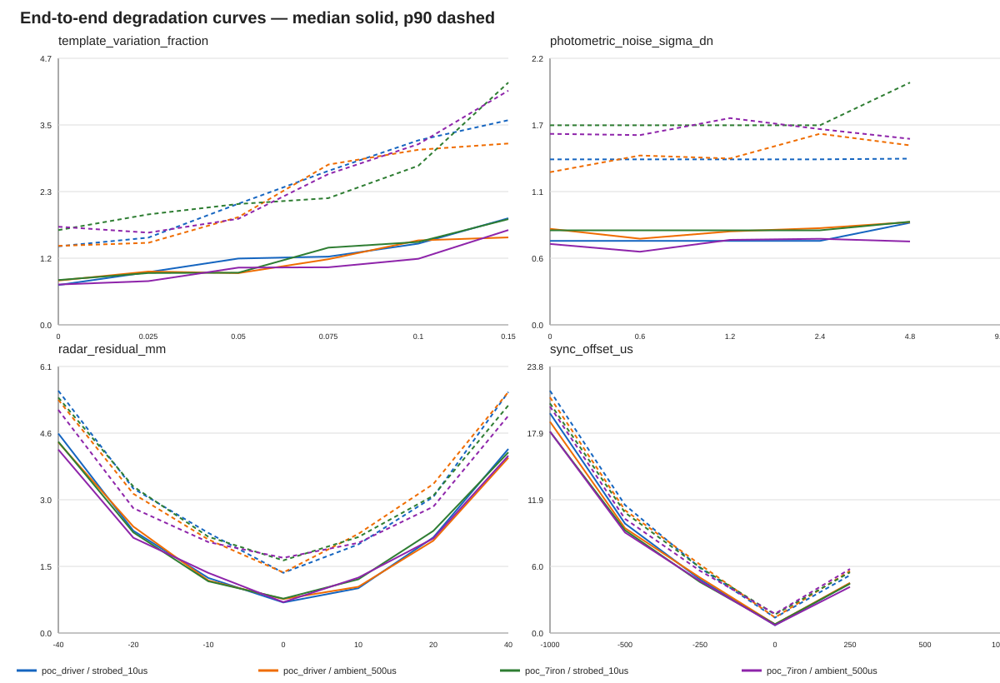

# End-to-end silhouette fusion evaluation

**AMBIENT 500 us: NO** — poc_driver solve rate 0.665 < 0.800.

Evaluation hash: `b4d4f99d1f9337105a7cf41f0885286cf51c1103680ce1bd049056c27715d5ad`

Every core cell uses the full immutable artifact path and production fusion solver.
Headline cells include registered per-club template variation (driver ±8%, 7-iron
±10%). Zero-mismatch controls isolate the frozen Phase 1b estimator. Both use one
strictly pre-impact frame; multi-frame temporal behavior is tested separately.
Rejected shots remain in the solve-rate denominator. median AND p90 are reported.

## Spec section 1 criteria — actual end-to-end results

| Club | Candidate | N | Solve rate | Vector median mm | Vector p90 mm | Signed horizontal median/p90 mm | Signed vertical median/p90 mm | IoU median | Fit residual median px | Quality rejection | Result |
|---|---|---:|---:|---:|---:|---:|---:|---:|---:|---:|---|
| poc_driver | strobed_10us | 200 | 0.880 | 1.35 | 3.18 | 0.21/2.37 | -0.30/1.20 | 0.923 | 5.64 | 0.120 | PASS |
| poc_driver | ambient_500us | 200 | 0.665 | 1.21 | 2.51 | -0.21/1.04 | -0.03/1.38 | 0.928 | 5.95 | 0.335 | FAIL |
| poc_7iron | strobed_10us | 200 | 1.000 | 1.69 | 3.44 | 0.53/2.82 | -0.49/1.57 | 0.899 | 4.78 | 0.000 | PASS |
| poc_7iron | ambient_500us | 200 | 0.935 | 1.48 | 3.14 | 0.23/1.99 | -0.15/1.76 | 0.903 | 5.48 | 0.065 | PASS |

## Ambient 500 us verdict

**NO** — poc_driver solve rate 0.665 < 0.800.

The ambient candidate uses 21-sample exposure integration at 500 us and the same
artifact loader, segmentation, exposure-template fit, radar solve, and temporal gates as
the strobed candidate. It is preferred Phase-A hardware only when this verdict is YES.

## Phase 1b reconciliation

**DIAGNOSED_MODEL_GAP**

Material disagreement limits were frozen before this run: 0.10 solve rate, 2 mm median,
and 4 mm p90 absolute delta.

| Club | Candidate | Solve delta | Median delta mm | p90 delta mm | Status |
|---|---|---:|---:|---:|---|
| poc_driver | strobed_10us | -0.113 | -0.34 | 0.15 | DIAGNOSED_MODEL_GAP |
| poc_driver | ambient_500us | -0.332 | -0.44 | -0.66 | DIAGNOSED_MODEL_GAP |
| poc_7iron | strobed_10us | 0.000 | -0.18 | -0.17 | AGREES |
| poc_7iron | ambient_500us | -0.065 | -0.42 | -0.62 | AGREES |

### Zero-mismatch reconciliation controls

| Club | Candidate | Solve | Median mm | p90 mm | Phase 1b status |
|---|---|---:|---:|---:|---|
| poc_driver | strobed_10us | 1.000 | 0.95 | 1.76 | AGREES |
| poc_driver | ambient_500us | 1.000 | 0.94 | 1.83 | AGREES |
| poc_7iron | strobed_10us | 1.000 | 0.98 | 2.18 | AGREES |
| poc_7iron | ambient_500us | 1.000 | 1.01 | 2.06 | AGREES |

A headline-cell disagreement is diagnosed as the registered template-dimension
model gap only when its paired zero-mismatch control agrees with Phase 1b.

## Failure taxonomy

- `poc_driver/strobed_10us`: silhouette_fit_residual:24
- `poc_driver/ambient_500us`: silhouette_fit_residual:67
- `poc_7iron/strobed_10us`: none:0
- `poc_7iron/ambient_500us`: silhouette_fit_residual:13

## Degradation curves

The committed JSON is the canonical curve data. The tables below retain solve rate,
median, and p90 at every sampled point.

### template_variation_fraction

| Club | Candidate | Value | N | Solve | Median mm | p90 mm | Failures |
|---|---|---:|---:|---:|---:|---:|---|
| poc_driver | strobed_10us | 0.000 | 24 | 1.000 | 0.70 | 1.38 | none |
| poc_driver | strobed_10us | 0.025 | 24 | 1.000 | 0.93 | 1.53 | none |
| poc_driver | strobed_10us | 0.050 | 24 | 1.000 | 1.16 | 2.12 | none |
| poc_driver | strobed_10us | 0.075 | 24 | 0.958 | 1.20 | 2.70 | silhouette_fit_residual:1 |
| poc_driver | strobed_10us | 0.100 | 24 | 0.875 | 1.42 | 3.24 | silhouette_fit_residual:3 |
| poc_driver | strobed_10us | 0.150 | 24 | 0.375 | 1.87 | 3.59 | component_shaft_connected:1, silhouette_fit_residual:14 |
| poc_driver | ambient_500us | 0.000 | 24 | 1.000 | 0.78 | 1.38 | none |
| poc_driver | ambient_500us | 0.025 | 24 | 0.875 | 0.94 | 1.44 | silhouette_fit_residual:3 |
| poc_driver | ambient_500us | 0.050 | 24 | 0.750 | 0.91 | 1.89 | silhouette_fit_residual:6 |
| poc_driver | ambient_500us | 0.075 | 24 | 0.750 | 1.15 | 2.81 | silhouette_fit_residual:6 |
| poc_driver | ambient_500us | 0.100 | 24 | 0.667 | 1.48 | 3.07 | silhouette_fit_residual:8 |
| poc_driver | ambient_500us | 0.150 | 24 | 0.417 | 1.53 | 3.18 | silhouette_fit_residual:14 |
| poc_7iron | strobed_10us | 0.000 | 24 | 1.000 | 0.79 | 1.66 | none |
| poc_7iron | strobed_10us | 0.025 | 24 | 1.000 | 0.91 | 1.94 | none |
| poc_7iron | strobed_10us | 0.050 | 24 | 1.000 | 0.91 | 2.12 | none |
| poc_7iron | strobed_10us | 0.075 | 24 | 1.000 | 1.35 | 2.22 | none |
| poc_7iron | strobed_10us | 0.100 | 24 | 1.000 | 1.45 | 2.79 | none |
| poc_7iron | strobed_10us | 0.150 | 24 | 1.000 | 1.85 | 4.25 | none |
| poc_7iron | ambient_500us | 0.000 | 24 | 1.000 | 0.71 | 1.72 | none |
| poc_7iron | ambient_500us | 0.025 | 24 | 1.000 | 0.77 | 1.62 | none |
| poc_7iron | ambient_500us | 0.050 | 24 | 1.000 | 1.00 | 1.86 | none |
| poc_7iron | ambient_500us | 0.075 | 24 | 1.000 | 1.01 | 2.64 | none |
| poc_7iron | ambient_500us | 0.100 | 24 | 1.000 | 1.16 | 3.17 | none |
| poc_7iron | ambient_500us | 0.150 | 24 | 0.917 | 1.66 | 4.11 | silhouette_fit_residual:2 |

### photometric_noise_sigma_dn

| Club | Candidate | Value | N | Solve | Median mm | p90 mm | Failures |
|---|---|---:|---:|---:|---:|---:|---|
| poc_driver | strobed_10us | 0.000 | 24 | 1.000 | 0.70 | 1.38 | none |
| poc_driver | strobed_10us | 0.600 | 24 | 1.000 | 0.70 | 1.38 | none |
| poc_driver | strobed_10us | 1.200 | 24 | 1.000 | 0.70 | 1.38 | none |
| poc_driver | strobed_10us | 2.400 | 24 | 1.000 | 0.70 | 1.38 | none |
| poc_driver | strobed_10us | 4.800 | 24 | 1.000 | 0.85 | 1.38 | none |
| poc_driver | strobed_10us | 9.600 | 24 | 0.000 | — | — | silhouette_fit_residual:23, visibility_club:1 |
| poc_driver | ambient_500us | 0.000 | 24 | 1.000 | 0.80 | 1.27 | none |
| poc_driver | ambient_500us | 0.600 | 24 | 1.000 | 0.72 | 1.41 | none |
| poc_driver | ambient_500us | 1.200 | 24 | 1.000 | 0.78 | 1.38 | none |
| poc_driver | ambient_500us | 2.400 | 24 | 1.000 | 0.81 | 1.59 | none |
| poc_driver | ambient_500us | 4.800 | 24 | 0.958 | 0.86 | 1.49 | silhouette_fit_residual:1 |
| poc_driver | ambient_500us | 9.600 | 24 | 0.000 | — | — | silhouette_fit_residual:24 |
| poc_7iron | strobed_10us | 0.000 | 24 | 1.000 | 0.79 | 1.66 | none |
| poc_7iron | strobed_10us | 0.600 | 24 | 1.000 | 0.79 | 1.66 | none |
| poc_7iron | strobed_10us | 1.200 | 24 | 1.000 | 0.79 | 1.66 | none |
| poc_7iron | strobed_10us | 2.400 | 24 | 1.000 | 0.79 | 1.66 | none |
| poc_7iron | strobed_10us | 4.800 | 24 | 1.000 | 0.86 | 2.02 | none |
| poc_7iron | strobed_10us | 9.600 | 24 | 0.000 | — | — | silhouette_ambiguous:1, silhouette_fit_residual:23 |
| poc_7iron | ambient_500us | 0.000 | 24 | 1.000 | 0.67 | 1.59 | none |
| poc_7iron | ambient_500us | 0.600 | 24 | 1.000 | 0.61 | 1.58 | none |
| poc_7iron | ambient_500us | 1.200 | 24 | 1.000 | 0.71 | 1.72 | none |
| poc_7iron | ambient_500us | 2.400 | 24 | 1.000 | 0.72 | 1.63 | none |
| poc_7iron | ambient_500us | 4.800 | 24 | 1.000 | 0.69 | 1.55 | none |
| poc_7iron | ambient_500us | 9.600 | 24 | 0.000 | — | — | silhouette_fit_residual:20, visibility_club:4 |

### radar_residual_mm

| Club | Candidate | Value | N | Solve | Median mm | p90 mm | Failures |
|---|---|---:|---:|---:|---:|---:|---|
| poc_driver | strobed_10us | -40.000 | 24 | 1.000 | 4.56 | 5.54 | none |
| poc_driver | strobed_10us | -20.000 | 24 | 1.000 | 2.34 | 3.31 | none |
| poc_driver | strobed_10us | -10.000 | 24 | 1.000 | 1.26 | 2.29 | none |
| poc_driver | strobed_10us | 0.000 | 24 | 1.000 | 0.70 | 1.38 | none |
| poc_driver | strobed_10us | 10.000 | 24 | 1.000 | 1.03 | 2.03 | none |
| poc_driver | strobed_10us | 20.000 | 24 | 1.000 | 2.19 | 3.11 | none |
| poc_driver | strobed_10us | 40.000 | 24 | 1.000 | 4.21 | 5.52 | none |
| poc_driver | ambient_500us | -40.000 | 24 | 1.000 | 4.36 | 5.33 | none |
| poc_driver | ambient_500us | -20.000 | 24 | 1.000 | 2.44 | 3.19 | none |
| poc_driver | ambient_500us | -10.000 | 24 | 1.000 | 1.20 | 2.14 | none |
| poc_driver | ambient_500us | 0.000 | 24 | 1.000 | 0.78 | 1.38 | none |
| poc_driver | ambient_500us | 10.000 | 24 | 1.000 | 1.06 | 2.27 | none |
| poc_driver | ambient_500us | 20.000 | 24 | 0.875 | 2.11 | 3.41 | silhouette_fit_residual:3 |
| poc_driver | ambient_500us | 40.000 | 24 | 0.708 | 4.01 | 5.51 | silhouette_fit_residual:7 |
| poc_7iron | strobed_10us | -40.000 | 24 | 1.000 | 4.38 | 5.39 | none |
| poc_7iron | strobed_10us | -20.000 | 24 | 1.000 | 2.30 | 3.35 | none |
| poc_7iron | strobed_10us | -10.000 | 24 | 1.000 | 1.18 | 2.20 | none |
| poc_7iron | strobed_10us | 0.000 | 24 | 1.000 | 0.79 | 1.66 | none |
| poc_7iron | strobed_10us | 10.000 | 24 | 1.000 | 1.23 | 2.20 | none |
| poc_7iron | strobed_10us | 20.000 | 24 | 1.000 | 2.34 | 3.14 | none |
| poc_7iron | strobed_10us | 40.000 | 24 | 1.000 | 4.13 | 5.21 | none |
| poc_7iron | ambient_500us | -40.000 | 24 | 1.000 | 4.20 | 5.10 | none |
| poc_7iron | ambient_500us | -20.000 | 24 | 1.000 | 2.18 | 2.86 | none |
| poc_7iron | ambient_500us | -10.000 | 24 | 1.000 | 1.38 | 2.08 | none |
| poc_7iron | ambient_500us | 0.000 | 24 | 1.000 | 0.71 | 1.72 | none |
| poc_7iron | ambient_500us | 10.000 | 24 | 1.000 | 1.27 | 2.06 | none |
| poc_7iron | ambient_500us | 20.000 | 24 | 1.000 | 2.17 | 2.89 | none |
| poc_7iron | ambient_500us | 40.000 | 24 | 1.000 | 4.06 | 4.97 | none |

### sync_offset_us

| Club | Candidate | Value | N | Solve | Median mm | p90 mm | Failures |
|---|---|---:|---:|---:|---:|---:|---|
| poc_driver | strobed_10us | -1000.000 | 24 | 1.000 | 19.62 | 21.64 | none |
| poc_driver | strobed_10us | -500.000 | 24 | 1.000 | 9.78 | 11.44 | none |
| poc_driver | strobed_10us | -250.000 | 24 | 1.000 | 4.79 | 5.82 | none |
| poc_driver | strobed_10us | 0.000 | 24 | 1.000 | 0.70 | 1.38 | none |
| poc_driver | strobed_10us | 250.000 | 24 | 1.000 | 4.46 | 5.17 | none |
| poc_driver | strobed_10us | 500.000 | 24 | 0.000 | — | — | extrapolation_horizon:24 |
| poc_driver | strobed_10us | 1000.000 | 24 | 0.000 | — | — | extrapolation_horizon:24 |
| poc_driver | ambient_500us | -1000.000 | 24 | 0.708 | 18.87 | 21.05 | silhouette_fit_residual:7 |
| poc_driver | ambient_500us | -500.000 | 24 | 0.833 | 9.37 | 10.98 | silhouette_fit_residual:4 |
| poc_driver | ambient_500us | -250.000 | 24 | 1.000 | 4.94 | 6.12 | none |
| poc_driver | ambient_500us | 0.000 | 24 | 1.000 | 0.78 | 1.38 | none |
| poc_driver | ambient_500us | 250.000 | 24 | 1.000 | 4.48 | 5.55 | none |
| poc_driver | ambient_500us | 500.000 | 24 | 0.000 | — | — | extrapolation_horizon:24 |
| poc_driver | ambient_500us | 1000.000 | 24 | 0.000 | — | — | extrapolation_horizon:24 |
| poc_7iron | strobed_10us | -1000.000 | 24 | 1.000 | 17.99 | 20.51 | none |
| poc_7iron | strobed_10us | -500.000 | 24 | 1.000 | 9.18 | 10.76 | none |
| poc_7iron | strobed_10us | -250.000 | 24 | 1.000 | 4.55 | 5.86 | none |
| poc_7iron | strobed_10us | 0.000 | 24 | 1.000 | 0.79 | 1.66 | none |
| poc_7iron | strobed_10us | 250.000 | 24 | 1.000 | 4.40 | 5.42 | none |
| poc_7iron | strobed_10us | 500.000 | 24 | 0.000 | — | — | extrapolation_horizon:24 |
| poc_7iron | strobed_10us | 1000.000 | 24 | 0.000 | — | — | extrapolation_horizon:24 |
| poc_7iron | ambient_500us | -1000.000 | 24 | 1.000 | 17.99 | 20.23 | none |
| poc_7iron | ambient_500us | -500.000 | 24 | 1.000 | 8.98 | 10.20 | none |
| poc_7iron | ambient_500us | -250.000 | 24 | 1.000 | 4.65 | 5.56 | none |
| poc_7iron | ambient_500us | 0.000 | 24 | 1.000 | 0.71 | 1.72 | none |
| poc_7iron | ambient_500us | 250.000 | 24 | 1.000 | 4.12 | 5.72 | none |
| poc_7iron | ambient_500us | 500.000 | 24 | 0.000 | — | — | extrapolation_horizon:24 |
| poc_7iron | ambient_500us | 1000.000 | 24 | 0.000 | — | — | extrapolation_horizon:24 |
