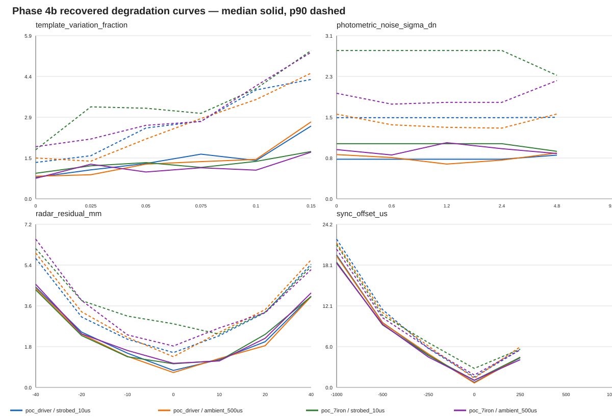

# Phase 4b ambient-recovery evaluation

**Registration:** rules frozen before the outcome run on 2026-08-23.

Frozen: seven strictly pre-impact frames; cascaded latest-three fusion with at least
two accepted states; sharp residual <=8.0 px; 500 us blur-aware residual <=12.0 px;
position RMS <=5.0 mm; angular RMS <=0.008 rad; horizon <=2.5 ms; N=200 per
primary cell; calibrated-template residual variation=1%; same Phase 4 seeds.
Registration erratum: the pre-run Markdown draft said 3.0 ms, while the executable
solver constant and tests were already frozen at the stricter 2.5 ms used for every
shot. No threshold changed after outcomes were observed.
Maintainer-directed speed extension (2026-08-24): driver 90--150 mph in
10 mph steps, ambient and comparison-only strobe, N=24 per point, using the
existing Phase 4b sweep seed family. This axis was requested after an ad-hoc
probe, so it is an official committed degradation record, not a blind gate.

**AMBIENT RECOVERY: YES** — calibrated ambient driver and 7-iron meet the frozen recovery gates.

Strobe is comparison-only and cannot win the buildable gate.

Evaluation hash: `0777378db53dbbb152a1dd00edd9355580f4c8327103584bd4fd0fc1e24168d8`

## Final calibrated criteria table

| Club | Candidate | N | Solve | Median mm | p90 mm | Signed horizontal median/p90 mm | Signed vertical median/p90 mm | IoU | Result |
|---|---|---:|---:|---:|---:|---:|---:|---:|---|
| poc_driver | strobed_10us | 200 | 1.000 | 0.95 | 1.86 | 0.06/1.01 | -0.09/1.15 | 0.967 | PASS |
| poc_driver | ambient_500us | 200 | 1.000 | 0.93 | 1.82 | 0.08/1.06 | -0.15/1.06 | 0.975 | PASS |
| poc_7iron | strobed_10us | 200 | 1.000 | 1.10 | 2.77 | 0.33/1.96 | -0.45/1.06 | 0.959 | PASS |
| poc_7iron | ambient_500us | 200 | 1.000 | 1.09 | 2.43 | 0.11/1.22 | -0.33/1.04 | 0.960 | PASS |

## All paired mitigation cells

Population variation is +/-8% for driver and +/-10% for 7-iron through the
blur-aware stage. Only `calibrated_template` uses 1% residual variation.

| Stage | Club | Candidate | N | Solve | Median mm | p90 mm | Signed horizontal median/p90 mm | Signed vertical median/p90 mm | IoU |
|---|---|---|---:|---:|---:|---:|---:|---:|---:|
| baseline | poc_driver | strobed_10us | 200 | 0.880 | 1.35 | 3.18 | 0.21/2.37 | -0.30/1.20 | 0.923 |
| baseline | poc_driver | ambient_500us | 200 | 0.665 | 1.21 | 2.51 | -0.21/1.04 | -0.03/1.38 | 0.928 |
| baseline | poc_7iron | strobed_10us | 200 | 1.000 | 1.69 | 3.44 | 0.53/2.82 | -0.49/1.57 | 0.899 |
| baseline | poc_7iron | ambient_500us | 200 | 0.935 | 1.48 | 3.14 | 0.23/1.99 | -0.15/1.76 | 0.903 |
| temporal_only | poc_driver | strobed_10us | 200 | 0.845 | 1.41 | 3.41 | 0.08/2.03 | -0.30/1.46 | 0.931 |
| temporal_only | poc_driver | ambient_500us | 200 | 0.655 | 1.22 | 2.52 | -0.25/0.99 | -0.02/1.32 | 0.935 |
| temporal_only | poc_7iron | strobed_10us | 200 | 1.000 | 1.83 | 4.19 | 0.56/3.51 | -0.61/1.70 | 0.907 |
| temporal_only | poc_7iron | ambient_500us | 200 | 0.935 | 1.67 | 3.84 | 0.19/2.42 | -0.38/1.73 | 0.913 |
| blur_aware | poc_driver | strobed_10us | 200 | 0.845 | 1.41 | 3.41 | 0.08/2.03 | -0.30/1.46 | 0.931 |
| blur_aware | poc_driver | ambient_500us | 200 | 1.000 | 1.33 | 2.90 | -0.16/1.42 | -0.27/1.30 | 0.930 |
| blur_aware | poc_7iron | strobed_10us | 200 | 1.000 | 1.83 | 4.19 | 0.56/3.51 | -0.61/1.70 | 0.907 |
| blur_aware | poc_7iron | ambient_500us | 200 | 1.000 | 1.69 | 3.81 | 0.18/2.40 | -0.44/1.64 | 0.908 |
| calibrated_template | poc_driver | strobed_10us | 200 | 1.000 | 0.95 | 1.86 | 0.06/1.01 | -0.09/1.15 | 0.967 |
| calibrated_template | poc_driver | ambient_500us | 200 | 1.000 | 0.93 | 1.82 | 0.08/1.06 | -0.15/1.06 | 0.975 |
| calibrated_template | poc_7iron | strobed_10us | 200 | 1.000 | 1.10 | 2.77 | 0.33/1.96 | -0.45/1.06 | 0.959 |
| calibrated_template | poc_7iron | ambient_500us | 200 | 1.000 | 1.09 | 2.43 | 0.11/1.22 | -0.33/1.04 | 0.960 |

## Before/after solve-rate attribution

| Club | Candidate | Stage | Solve | Incremental recovery | Recovered shots |
|---|---|---|---:|---:|---:|
| poc_driver | strobed_10us | baseline | 0.880 | 0.000 | 0 |
| poc_driver | strobed_10us | temporal_only | 0.845 | -0.035 | -7 |
| poc_driver | strobed_10us | blur_aware | 0.845 | 0.000 | 0 |
| poc_driver | strobed_10us | calibrated_template | 1.000 | 0.155 | 31 |
| poc_driver | ambient_500us | baseline | 0.665 | 0.000 | 0 |
| poc_driver | ambient_500us | temporal_only | 0.655 | -0.010 | -2 |
| poc_driver | ambient_500us | blur_aware | 1.000 | 0.345 | 69 |
| poc_driver | ambient_500us | calibrated_template | 1.000 | 0.000 | 0 |
| poc_7iron | strobed_10us | baseline | 1.000 | 0.000 | 0 |
| poc_7iron | strobed_10us | temporal_only | 1.000 | 0.000 | 0 |
| poc_7iron | strobed_10us | blur_aware | 1.000 | 0.000 | 0 |
| poc_7iron | strobed_10us | calibrated_template | 1.000 | 0.000 | 0 |
| poc_7iron | ambient_500us | baseline | 0.935 | 0.000 | 0 |
| poc_7iron | ambient_500us | temporal_only | 0.935 | 0.000 | 0 |
| poc_7iron | ambient_500us | blur_aware | 1.000 | 0.065 | 13 |
| poc_7iron | ambient_500us | calibrated_template | 1.000 | 0.000 | 0 |

## Reconciliation

**RECONCILED_OR_DIAGNOSED**

Baseline reruns must reproduce Phase 4 exactly. Zero-mismatch controls retain the
Phase 1b material limits: solve rate 0.10, median 2 mm, p90 4 mm.

### Phase 4 baseline reproduction

| Club | Candidate | Status | Solve delta | Median delta mm | p90 delta mm |
|---|---|---|---:|---:|---:|
| poc_driver | strobed_10us | EXACT | 0.000 | 0.00 | 0.00 |
| poc_driver | ambient_500us | EXACT | 0.000 | 0.00 | 0.00 |
| poc_7iron | strobed_10us | EXACT | 0.000 | 0.00 | 0.00 |
| poc_7iron | ambient_500us | EXACT | 0.000 | 0.00 | 0.00 |

### Zero-mismatch controls

| Club | Candidate | Solve | Median mm | p90 mm | Status |
|---|---|---:|---:|---:|---|
| poc_driver | strobed_10us | 1.000 | 0.95 | 1.85 | AGREES |
| poc_driver | ambient_500us | 1.000 | 0.94 | 1.77 | AGREES |
| poc_7iron | strobed_10us | 1.000 | 1.09 | 2.80 | AGREES |
| poc_7iron | ambient_500us | 1.000 | 1.01 | 2.36 | AGREES |

## Failure taxonomy

- `baseline/poc_driver/strobed_10us`: silhouette_fit_residual:24
- `baseline/poc_driver/ambient_500us`: silhouette_fit_residual:67
- `baseline/poc_7iron/strobed_10us`: none
- `baseline/poc_7iron/ambient_500us`: silhouette_fit_residual:13
- `temporal_only/poc_driver/strobed_10us`: extrapolation_horizon:1, silhouette_fit_residual:30
- `temporal_only/poc_driver/ambient_500us`: extrapolation_horizon:31, silhouette_fit_residual:38
- `temporal_only/poc_7iron/strobed_10us`: none
- `temporal_only/poc_7iron/ambient_500us`: extrapolation_horizon:10, silhouette_fit_residual:3
- `blur_aware/poc_driver/strobed_10us`: extrapolation_horizon:1, silhouette_fit_residual:30
- `blur_aware/poc_driver/ambient_500us`: none
- `blur_aware/poc_7iron/strobed_10us`: none
- `blur_aware/poc_7iron/ambient_500us`: none
- `calibrated_template/poc_driver/strobed_10us`: none
- `calibrated_template/poc_driver/ambient_500us`: none
- `calibrated_template/poc_7iron/strobed_10us`: none
- `calibrated_template/poc_7iron/ambient_500us`: none

## Degradation curves

### template_variation_fraction

| Club | Candidate | Value | N | Solve | Median mm | p90 mm | Failures |
|---|---|---:|---:|---:|---:|---:|---|
| poc_driver | strobed_10us | 0.000 | 24 | 1.000 | 0.77 | 1.31 | none |
| poc_driver | strobed_10us | 0.025 | 24 | 1.000 | 1.04 | 1.55 | none |
| poc_driver | strobed_10us | 0.050 | 24 | 1.000 | 1.27 | 2.55 | none |
| poc_driver | strobed_10us | 0.075 | 24 | 0.958 | 1.61 | 2.80 | silhouette_fit_residual:1 |
| poc_driver | strobed_10us | 0.100 | 24 | 0.750 | 1.38 | 3.92 | silhouette_fit_residual:6 |
| poc_driver | strobed_10us | 0.150 | 24 | 0.375 | 2.62 | 4.30 | silhouette_fit_residual:15 |
| poc_driver | ambient_500us | 0.000 | 24 | 1.000 | 0.81 | 1.47 | none |
| poc_driver | ambient_500us | 0.025 | 24 | 1.000 | 0.87 | 1.36 | none |
| poc_driver | ambient_500us | 0.050 | 24 | 1.000 | 1.25 | 2.15 | none |
| poc_driver | ambient_500us | 0.075 | 24 | 1.000 | 1.34 | 2.89 | none |
| poc_driver | ambient_500us | 0.100 | 24 | 1.000 | 1.42 | 3.58 | none |
| poc_driver | ambient_500us | 0.150 | 24 | 0.958 | 2.78 | 4.53 | silhouette_fit_residual:1 |
| poc_7iron | strobed_10us | 0.000 | 24 | 1.000 | 0.92 | 1.77 | none |
| poc_7iron | strobed_10us | 0.025 | 24 | 1.000 | 1.19 | 3.32 | none |
| poc_7iron | strobed_10us | 0.050 | 24 | 1.000 | 1.30 | 3.27 | none |
| poc_7iron | strobed_10us | 0.075 | 24 | 1.000 | 1.13 | 3.08 | none |
| poc_7iron | strobed_10us | 0.100 | 24 | 1.000 | 1.35 | 3.97 | none |
| poc_7iron | strobed_10us | 0.150 | 24 | 1.000 | 1.71 | 5.35 | none |
| poc_7iron | ambient_500us | 0.000 | 24 | 1.000 | 0.74 | 1.88 | none |
| poc_7iron | ambient_500us | 0.025 | 24 | 1.000 | 1.25 | 2.16 | none |
| poc_7iron | ambient_500us | 0.050 | 24 | 1.000 | 0.97 | 2.65 | none |
| poc_7iron | ambient_500us | 0.075 | 24 | 1.000 | 1.12 | 2.79 | none |
| poc_7iron | ambient_500us | 0.100 | 24 | 1.000 | 1.03 | 4.07 | none |
| poc_7iron | ambient_500us | 0.150 | 24 | 1.000 | 1.68 | 5.28 | none |

### photometric_noise_sigma_dn

| Club | Candidate | Value | N | Solve | Median mm | p90 mm | Failures |
|---|---|---:|---:|---:|---:|---:|---|
| poc_driver | strobed_10us | 0.000 | 24 | 1.000 | 0.75 | 1.54 | none |
| poc_driver | strobed_10us | 0.600 | 24 | 1.000 | 0.75 | 1.54 | none |
| poc_driver | strobed_10us | 1.200 | 24 | 1.000 | 0.75 | 1.54 | none |
| poc_driver | strobed_10us | 2.400 | 24 | 1.000 | 0.75 | 1.54 | none |
| poc_driver | strobed_10us | 4.800 | 24 | 1.000 | 0.83 | 1.55 | none |
| poc_driver | strobed_10us | 9.600 | 24 | 0.000 | — | — | insufficient_temporal_frames:2, silhouette_fit_residual:21, visibility_club:1 |
| poc_driver | ambient_500us | 0.000 | 24 | 1.000 | 0.84 | 1.61 | none |
| poc_driver | ambient_500us | 0.600 | 24 | 1.000 | 0.78 | 1.41 | none |
| poc_driver | ambient_500us | 1.200 | 24 | 1.000 | 0.66 | 1.36 | none |
| poc_driver | ambient_500us | 2.400 | 24 | 1.000 | 0.74 | 1.34 | none |
| poc_driver | ambient_500us | 4.800 | 24 | 1.000 | 0.87 | 1.61 | none |
| poc_driver | ambient_500us | 9.600 | 24 | 0.000 | — | — | insufficient_temporal_frames:1, silhouette_fit_residual:22, visibility_club:1 |
| poc_7iron | strobed_10us | 0.000 | 24 | 1.000 | 1.05 | 2.82 | none |
| poc_7iron | strobed_10us | 0.600 | 24 | 1.000 | 1.05 | 2.82 | none |
| poc_7iron | strobed_10us | 1.200 | 24 | 1.000 | 1.05 | 2.82 | none |
| poc_7iron | strobed_10us | 2.400 | 24 | 1.000 | 1.05 | 2.82 | none |
| poc_7iron | strobed_10us | 4.800 | 24 | 1.000 | 0.90 | 2.35 | none |
| poc_7iron | strobed_10us | 9.600 | 24 | 0.000 | — | — | extrapolation_horizon:4, silhouette_fit_residual:20 |
| poc_7iron | ambient_500us | 0.000 | 24 | 1.000 | 0.93 | 2.00 | none |
| poc_7iron | ambient_500us | 0.600 | 24 | 1.000 | 0.83 | 1.80 | none |
| poc_7iron | ambient_500us | 1.200 | 24 | 1.000 | 1.07 | 1.83 | none |
| poc_7iron | ambient_500us | 2.400 | 24 | 1.000 | 0.95 | 1.83 | none |
| poc_7iron | ambient_500us | 4.800 | 24 | 1.000 | 0.86 | 2.25 | none |
| poc_7iron | ambient_500us | 9.600 | 24 | 0.000 | — | — | extrapolation_horizon:8, silhouette_fit_residual:16 |

### radar_residual_mm

| Club | Candidate | Value | N | Solve | Median mm | p90 mm | Failures |
|---|---|---:|---:|---:|---:|---:|---|
| poc_driver | strobed_10us | -40.000 | 24 | 1.000 | 4.44 | 5.72 | none |
| poc_driver | strobed_10us | -20.000 | 24 | 1.000 | 2.45 | 3.12 | none |
| poc_driver | strobed_10us | -10.000 | 24 | 1.000 | 1.52 | 2.13 | none |
| poc_driver | strobed_10us | 0.000 | 24 | 1.000 | 0.75 | 1.54 | none |
| poc_driver | strobed_10us | 10.000 | 24 | 1.000 | 1.23 | 2.29 | none |
| poc_driver | strobed_10us | 20.000 | 24 | 1.000 | 2.02 | 3.32 | none |
| poc_driver | strobed_10us | 40.000 | 24 | 0.958 | 4.04 | 5.45 | extrapolation_horizon:1 |
| poc_driver | ambient_500us | -40.000 | 24 | 1.000 | 4.39 | 5.95 | none |
| poc_driver | ambient_500us | -20.000 | 24 | 1.000 | 2.36 | 3.35 | none |
| poc_driver | ambient_500us | -10.000 | 24 | 1.000 | 1.37 | 2.21 | none |
| poc_driver | ambient_500us | 0.000 | 24 | 1.000 | 0.66 | 1.36 | none |
| poc_driver | ambient_500us | 10.000 | 24 | 1.000 | 1.28 | 2.44 | none |
| poc_driver | ambient_500us | 20.000 | 24 | 1.000 | 1.85 | 3.44 | none |
| poc_driver | ambient_500us | 40.000 | 24 | 1.000 | 4.02 | 5.65 | none |
| poc_7iron | strobed_10us | -40.000 | 24 | 1.000 | 4.32 | 6.15 | none |
| poc_7iron | strobed_10us | -20.000 | 24 | 1.000 | 2.29 | 3.85 | none |
| poc_7iron | strobed_10us | -10.000 | 24 | 1.000 | 1.36 | 3.16 | none |
| poc_7iron | strobed_10us | 0.000 | 24 | 1.000 | 1.05 | 2.82 | none |
| poc_7iron | strobed_10us | 10.000 | 24 | 1.000 | 1.18 | 2.36 | none |
| poc_7iron | strobed_10us | 20.000 | 24 | 1.000 | 2.35 | 3.34 | none |
| poc_7iron | strobed_10us | 40.000 | 24 | 1.000 | 4.03 | 5.35 | none |
| poc_7iron | ambient_500us | -40.000 | 24 | 1.000 | 4.57 | 6.57 | none |
| poc_7iron | ambient_500us | -20.000 | 24 | 1.000 | 2.37 | 3.85 | none |
| poc_7iron | ambient_500us | -10.000 | 24 | 1.000 | 1.63 | 2.33 | none |
| poc_7iron | ambient_500us | 0.000 | 24 | 1.000 | 1.07 | 1.83 | none |
| poc_7iron | ambient_500us | 10.000 | 24 | 1.000 | 1.17 | 2.63 | none |
| poc_7iron | ambient_500us | 20.000 | 24 | 1.000 | 2.18 | 3.31 | none |
| poc_7iron | ambient_500us | 40.000 | 24 | 1.000 | 4.19 | 5.22 | none |

### sync_offset_us

| Club | Candidate | Value | N | Solve | Median mm | p90 mm | Failures |
|---|---|---:|---:|---:|---:|---:|---|
| poc_driver | strobed_10us | -1000.000 | 24 | 0.958 | 19.61 | 21.96 | extrapolation_horizon:1 |
| poc_driver | strobed_10us | -500.000 | 24 | 1.000 | 9.61 | 11.53 | none |
| poc_driver | strobed_10us | -250.000 | 24 | 1.000 | 4.78 | 5.77 | none |
| poc_driver | strobed_10us | 0.000 | 24 | 1.000 | 0.75 | 1.54 | none |
| poc_driver | strobed_10us | 250.000 | 24 | 1.000 | 4.40 | 5.57 | none |
| poc_driver | strobed_10us | 500.000 | 24 | 0.000 | — | — | extrapolation_horizon:24 |
| poc_driver | strobed_10us | 1000.000 | 24 | 0.000 | — | — | extrapolation_horizon:24 |
| poc_driver | ambient_500us | -1000.000 | 24 | 1.000 | 19.45 | 21.39 | none |
| poc_driver | ambient_500us | -500.000 | 24 | 1.000 | 9.57 | 11.12 | none |
| poc_driver | ambient_500us | -250.000 | 24 | 1.000 | 4.97 | 6.12 | none |
| poc_driver | ambient_500us | 0.000 | 24 | 1.000 | 0.66 | 1.36 | none |
| poc_driver | ambient_500us | 250.000 | 24 | 1.000 | 4.47 | 6.01 | none |
| poc_driver | ambient_500us | 500.000 | 24 | 0.000 | — | — | extrapolation_horizon:24 |
| poc_driver | ambient_500us | 1000.000 | 24 | 0.000 | — | — | extrapolation_horizon:24 |
| poc_7iron | strobed_10us | -1000.000 | 24 | 1.000 | 18.55 | 21.15 | none |
| poc_7iron | strobed_10us | -500.000 | 24 | 1.000 | 9.27 | 10.68 | none |
| poc_7iron | strobed_10us | -250.000 | 24 | 1.000 | 4.73 | 6.63 | none |
| poc_7iron | strobed_10us | 0.000 | 24 | 1.000 | 1.05 | 2.82 | none |
| poc_7iron | strobed_10us | 250.000 | 24 | 1.000 | 4.45 | 5.67 | none |
| poc_7iron | strobed_10us | 500.000 | 24 | 0.000 | — | — | extrapolation_horizon:24 |
| poc_7iron | strobed_10us | 1000.000 | 24 | 0.000 | — | — | extrapolation_horizon:24 |
| poc_7iron | ambient_500us | -1000.000 | 24 | 1.000 | 18.40 | 20.48 | none |
| poc_7iron | ambient_500us | -500.000 | 24 | 1.000 | 9.36 | 10.33 | none |
| poc_7iron | ambient_500us | -250.000 | 24 | 1.000 | 4.49 | 5.83 | none |
| poc_7iron | ambient_500us | 0.000 | 24 | 1.000 | 1.07 | 1.83 | none |
| poc_7iron | ambient_500us | 250.000 | 24 | 1.000 | 4.10 | 5.59 | none |
| poc_7iron | ambient_500us | 500.000 | 24 | 0.000 | — | — | extrapolation_horizon:24 |
| poc_7iron | ambient_500us | 1000.000 | 24 | 0.000 | — | — | extrapolation_horizon:24 |

### club_speed_mph

| Club | Candidate | Value | N | Solve | Median mm | p90 mm | Failures |
|---|---|---:|---:|---:|---:|---:|---|
| poc_driver | strobed_10us | 90.000 | 24 | 1.000 | 0.81 | 1.61 | none |
| poc_driver | strobed_10us | 100.000 | 24 | 1.000 | 0.91 | 2.03 | none |
| poc_driver | strobed_10us | 110.000 | 24 | 1.000 | 0.82 | 1.65 | none |
| poc_driver | strobed_10us | 120.000 | 24 | 1.000 | 0.77 | 1.54 | none |
| poc_driver | strobed_10us | 130.000 | 24 | 1.000 | 1.02 | 2.71 | none |
| poc_driver | strobed_10us | 140.000 | 24 | 1.000 | 1.14 | 2.48 | none |
| poc_driver | strobed_10us | 150.000 | 24 | 1.000 | 0.84 | 1.66 | none |
| poc_driver | ambient_500us | 90.000 | 24 | 1.000 | 0.98 | 1.72 | none |
| poc_driver | ambient_500us | 100.000 | 24 | 1.000 | 1.16 | 1.65 | none |
| poc_driver | ambient_500us | 110.000 | 24 | 1.000 | 0.81 | 1.48 | none |
| poc_driver | ambient_500us | 120.000 | 24 | 1.000 | 0.93 | 1.68 | none |
| poc_driver | ambient_500us | 130.000 | 24 | 1.000 | 1.02 | 1.77 | none |
| poc_driver | ambient_500us | 140.000 | 24 | 1.000 | 1.34 | 1.74 | none |
| poc_driver | ambient_500us | 150.000 | 24 | 1.000 | 1.09 | 1.88 | none |
